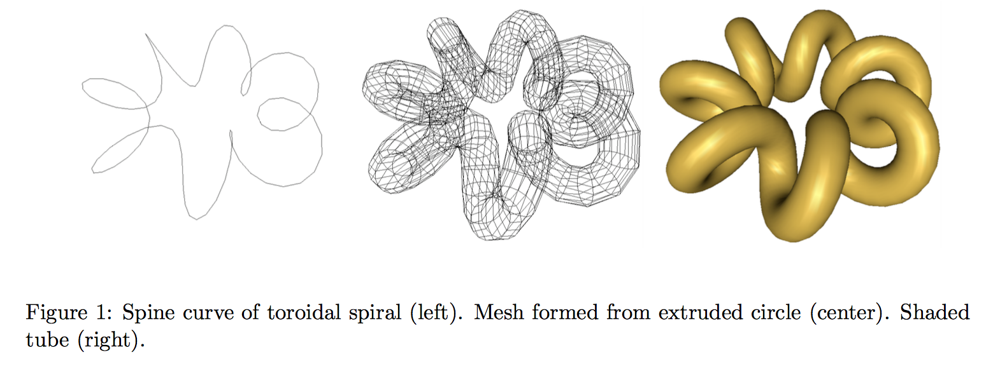

# WebGL Toroidal Spirals

Create a mesh that approximates a surface defined by extruding a circle along the path of a toroidal spiral. 
The project consists of three phases. For the first phase, write an OpenGL program that simply draws the 
spine curve as shown on the left of Figure 1. In the second phase, you will build and render a wire frame mesh as 
shown in the center of Figure 1. Finally, you will render a smooth shaded version of the visible portion of the 
surface.

<center></center>

## Getting Started

To run simply extract folder Toroidal from archive. Open in favorite browser.
```
'.../Toroidal/toroidal.html' 
```

## Archive Contents

```
/Toroidal               - root folder
    /matrix.js          - Wayne O. Cochran matrix library
    /toroidal.js        - Holds the defined Toroidal Spiral object
    /toroidal.html      - Creates HTML canvas and renders Toroidal Spiral object in Canvas
    /README.md          
    /rsc                - Holds README image resources
        /figure1.png    
```

## Deployment

Tested on Safari and Chrome

## Built With

* WebGl
* JavaScript
* HTML/CSS

## Authors

* **Spencer Kitchen** - Oct 21 2016

## Acknowledgments

* Wayne O. Cochran's torus.html and torus.js used as model for toroidal.html and toroidal.js
* Wayne O. Cochran for providing matrix.js library for MVP transformations.
